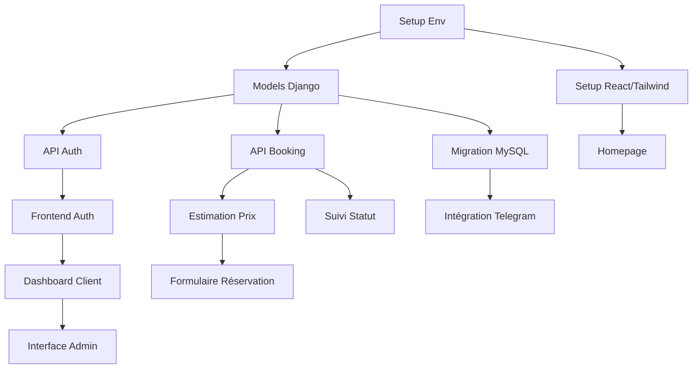

# Sprint planning - plateforme VTC

##  Vue d'ensemble du planning
**Durée totale** : 4 semaines (2 sprints de 2 semaines)
**Équipe** : 2 développeurs (Gabriel - Backend, Brahim - Frontend)
**Méthodologie** : Agile avec priorisation MoSCoW

---

## Sprint 1 : Fondations et architecture core
**Durée** : Semaines 1-2 (14 jours)
**Objectif** : Établir l'infrastructure technique et développer les fonctionnalités essentielles

###  Répartition des user stories (MoSCoW)

####  MUST HAVE (Priorité 1)

| US ID | User Story | Estimation | Assigné | Dépendances |

| US001 | Saisir adresses départ/arrivée | 3j | Brahim | Setup React/Tailwind 

| US002 | Estimation prix avant confirmation | 2j | Gabriel | Models, API pricing |

| US003 | Confirmation par email | 2j | Brahim | Models, SMTP config |

| US005 | Authentification et gestion compte | 3j | Gabriel | User model, JWT |

| US013 | Réception demandes temps réel (Admin) | 2j | Gabriel | Booking model, API |
  
####  SHOULD HAVE (Si temps disponible)

| US ID | User Story | Estimation | Assigné | Dépendances |

| US008 | Géolocalisation automatique | 1j | Brahim | US001 complété |

###  Planning Détaillé Sprint 1

#### Semaine 1 (Jours 1-7)
**Gabriel - Backend**
-  **Jour 1-3** : Setup environnement Django + documentation
- Configuration projet Django
- Setup Django REST Framework
- Documentation des technologies
-  **Jour 4-7** : Modèles et structure
- Création modèles User, Booking, Driver, Invoice  
- Relations entre modèles  
- Migrations initiales
**Brahim - Frontend**
-  **Jour 1-2** : Setup environnement React + documentation
- Configuration React avec Vite
- Setup Tailwind CSS (résolution problèmes compatibilité)
- Documentation des technologies
-  **Jour 3-5** : Interface de base
- Structure composants React
- Homepage design et implémentation
- Navigation de base
-  **Jour 6-7** : Formulaires de base
- Composants d'authentification
- Formulaire de connexion
#### Semaine 2 (Jours 8-14)
**Gabriel - Backend**
-  **Jour 12-13** : API Authentification
- Endpoints login/register
- JWT token management
- Validation et sécurité
-  **Jour 13-14** : API Pricing et Booking
- Service de calcul de prix
- API estimation
- Début API booking
**Brahim - Frontend**
-  **Jour 8-10** : Formulaire de réservation
- Interface saisie adresses
- Intégration API estimation
-  **Jour 11-12** : Composants utilisateur
- Interface client de base
- Gestion états React
-  **Jour 12-13** : Configuration Email
- Setup Gmail SMTP
- Templates email
- Service notifications
-  **Jour 13-14** : Intégration
- Connexion frontend-backend
###  Objectifs de fin sprint 1
-  Modèles Django finalisés
-  APIs d'authentification fonctionnelles
-  Homepage React avec Tailwind
-  Formulaire de réservation de base
-  Système d'estimation de prix
---
## Sprint 2 : Intégration et finalisation
**Durée** : Semaines 3-4 (14 jours)
**Objectif** : Finaliser les APIs, intégrer les services externes, compléter l'interface utilisateur
###  Répartition des user stories
####  MUST HAVE (Priorité 1)
#### Semaine 3 (Jours 15-21) - "Coup de boost"
**Gabriel - Backend**
-  **Jour 15-16** : debug
- Debug APIs existantes
-  **Jour 17-18** : Migration base de données
- Passage → MySQL
- Reconfiguration modèles
-  **Jour 19-21** : Intégration Telegram
- Configuration Telegram Bot API
- Service notification chauffeurs
**Brahim - Frontend + Support Backend**
-  **Jour 15** : Finalisation APIs booking
- Debug mise à jour statuts
- API historique utilisateur
-  **Jour 16** : Interface client complète
- Pages register/login finalisées
- Dashboard client
-  **Jour 17-18** : Support intégration Gmail
- Configuration service email
- Tests notifications
-  **Jour 19-21** : Interface administrateur
- Dashboard admin de base
- Gestion des demandes
#### Semaine 4 (Jours 22-28) - Finalisation
**Gabriel - Backend**
-  **Jour 22-23** : APIs avancées
- API dashboard admin
-  **Jour 24-25** : Documentation API
- Setup Swagger
**Brahim - Frontend**
-  **Jour 22-23** : Finalisation UI
- Dashboard admin complet
- Pages client restantes
-  **Jour 24-28** : Intégration finale
- Connexion tous les endpoints
- Gestion erreurs
###  Objectifs de fin sprint 2
-  Toutes les APIs fonctionnelles
-  Intégrations Gmail et Telegram opérationnelles
-  Interface utilisateur complète
-  Dashboard administrateur
-  Base de données MySQL configurée
- Documentation API Swagger

---

##  Matrice des Dépendances




##  Risques Identifiés et Mitigation

| Risque | Probabilité | Impact | Mitigation |


| Problèmes setup Tailwind | Élevée | Moyen | Documentation, forums Reddit |

| Complexité APIs externes | Moyenne | Élevé | Allocation temps supplémentaire |

| Migration DB imprévue | Faible | Élevé | Tests précoces, backup |

| Intégration frontend-backend | Moyenne | Élevé | Tests d'intégration continus |

---

##  Responsabilités équipe
### Gabriel (Backend Lead)
- Architecture Django et APIs
- Modèles de données et migrations
- Intégrations services externes
- Documentation technique
### Brahim (Frontend Lead)
- Interface utilisateur React
- Intégration APIs frontend
- UI/UX et responsive design
- Documentation technique

### Collaboration
- Daily stand-ups informels
- Reviews de code croisées
---
### Source Repository
- Liens vers les repositories GitHub :
- Backend : `https://github.com/Gabriel-Nct/French-Driver/tree/develop/Stage-4/vtc-platform-backend`
- Frontend : `https://github.com/Gabriel-Nct/French-Driver/tree/develop/Stage-4/vtc-platform-frontend`
---

### Bug Tracking
- Système de suivi des bugs (GitHub Project) :

`https://github.com/users/Gabriel-Nct/projects/4`

---

### Test
- Test de l’API :

#### A. Authentification

-   **Client**
    
    ```bash
    CLIENT_TOKEN=$(curl -s -X POST <http://localhost:8000/api/auth/login/> \\
      -H "Content-Type: application/json" \\
      -d '{"username":"client1","password":"clientpass123"}' \\
      | jq -r '.access')
    ```
    
    → _OK : token JWT reçu_
    
-   **Admin**
    
    ```bash
    ADMIN_TOKEN=$(curl -s -X POST <http://localhost:8000/api/auth/login/> \\
      -H "Content-Type: application/json" \\
      -d '{"username":"brahim1","password":"Tcbnx$&9.G9E68j"}' \\
      | jq -r '.access')
    ```
    
    → _OK : token JWT reçu_
    

----------

#### B. Estimation de prix

```bash
curl -s -X POST <http://localhost:8000/api/bookings/estimate/> \\
  -H "Authorization: Bearer $CLIENT_TOKEN" \\
  -H "Content-Type: application/json" \\
  -d '{
    "pickup_address":"Opéra, Paris",
    "destination_address":"Champs-Élysées, Paris",
    "scheduled_time":"2025-06-20T18:00:00Z"
  }' | jq
```

→ _OK : renvoie distance, durée, tarif estimé_

----------

#### C. Création de réservation

```bash
BOOKING_ID=$(curl -s -X POST <http://localhost:8000/api/bookings/create/> \\
  -H "Authorization: Bearer $CLIENT_TOKEN" \\
  -H "Content-Type: application/json" \\
  -d '{
    "pickup_address":"Opéra, Paris",
    "pickup_latitude":48.8708,
    "pickup_longitude":2.3316,
    "destination_address":"Champs-Élysées, Paris",
    "destination_latitude":48.8698,
    "destination_longitude":2.3076,
    "scheduled_time":"2025-06-20T18:00:00Z",
    "estimated_price":25.00
  }' | jq -r '.data.booking_id')
echo "Booking #$BOOKING_ID créé"
```

→ _OK : réservation créée (ex. #10)_

----------

#### D. Assignation du chauffeur

```bash
curl -s -X POST <http://localhost:8000/api/admin/dispatch/> \\
  -H "Authorization: Bearer $ADMIN_TOKEN" \\
  -H "Content-Type: application/json" \\
  -d "{\\"action\\":\\"assign\\",\\"booking_id\\":$BOOKING_ID,\\"driver_id\\":1}" | jq
```

→ _OK : chauffeur assigné à la course_

----------

#### E. Passage en “IN_PROGRESS”

```bash
curl -s -X PATCH <http://localhost:8000/api/admin/bookings/$BOOKING_ID/update/> \\
  -H "Authorization: Bearer $ADMIN_TOKEN" \\
  -H "Content-Type: application/json" \\
  -d '{"status":"IN_PROGRESS"}' | jq
```

→ _OK : statut mis à jour en “IN_PROGRESS”_

----------

#### F. Terminaison de la course & génération de facture

```bash
curl -s -X PATCH <http://localhost:8000/api/admin/bookings/$BOOKING_ID/update/> \\
  -H "Authorization: Bearer $ADMIN_TOKEN" \\
  -H "Content-Type: application/json" \\
  -d '{
    "status":"COMPLETED",
    "final_price":30.00
  }' | jq
```

→ _OK : statut “COMPLETED”, `completed_at` à jour et facture générée_

----------

#### G. Récupération de la facture

```bash
curl -i -X GET <http://localhost:8000/api/invoices/$BOOKING_ID/> \\
  -H "Authorization: Bearer $CLIENT_TOKEN"
```

→ _OK : détails de la facture (numéro, montant, date, etc.)_

----------

#### H. Historique des courses (client)

```bash
curl -s -X GET <http://localhost:8000/api/bookings/user/5/> \\
  -H "Authorization: Bearer $CLIENT_TOKEN" \\
  -H "Content-Type: application/json" \\
  | jq
```

→ _OK : liste paginée des réservations du client_

----------

#### I. Dashboard admin (périodes “today”, “week”, “month”)

```bash
curl -s -X GET <http://localhost:8000/api/admin/dashboard/?period=today> \\
  -H "Authorization: Bearer $ADMIN_TOKEN" | jq

curl -s -X GET <http://localhost:8000/api/admin/dashboard/?period=week> \\
  -H "Authorization: Bearer $ADMIN_TOKEN" | jq

curl -s -X GET <http://localhost:8000/api/admin/dashboard/?period=month> \\
  -H "Authorization: Bearer $ADMIN_TOKEN" | jq
```

→ _OK : statistiques et récentes réservations_

----------

#### J. Broadcast (diffusion)

```bash
BOOKING_ID=$(curl -s -X POST <http://localhost:8000/api/bookings/create/> \\
  -H "Authorization: Bearer $CLIENT_TOKEN" \\
  -H "Content-Type: application/json" \\
  -d '{
    "pickup_address":"Gare de l’Est, Paris",
    "pickup_latitude":48.8766,
    "pickup_longitude":2.3580,
    "destination_address":"Bastille, Paris",
    "destination_latitude":48.8530,
    "destination_longitude":2.3690,
    "scheduled_time":"2025-06-21T18:00:00Z",
    "estimated_price":20.00
  }' | jq -r '.data.booking_id')

curl -s -X POST <http://localhost:8000/api/admin/dispatch/> \\
  -H "Authorization: Bearer $ADMIN_TOKEN" \\
  -H "Content-Type: application/json" \\
  -d "{\\"action\\":\\"broadcast\\",\\"booking_id\\":$BOOKING_ID}" | jq
```

→ _OK : diffusion aux chauffeurs disponibles_

----------

#### K. Annulation de réservation

```bash
curl -s -X PATCH <http://localhost:8000/api/admin/bookings/$BOOKING_ID/update/> \\
  -H "Authorization: Bearer $ADMIN_TOKEN" \\
  -H "Content-Type: application/json" \\
  -d '{"status":"CANCELLED"}' | jq
```

→ _OK : statut “CANCELLED”_

----------

#### L. Health-check

```bash
curl -X GET <http://localhost:8000/api/health/> | jq
```

→ _OK : API en ligne_

----------
